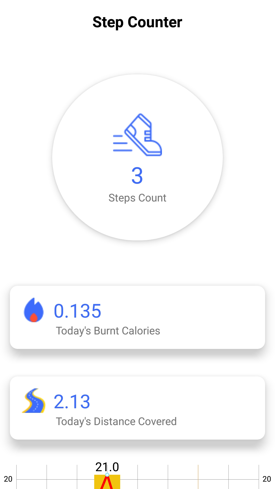
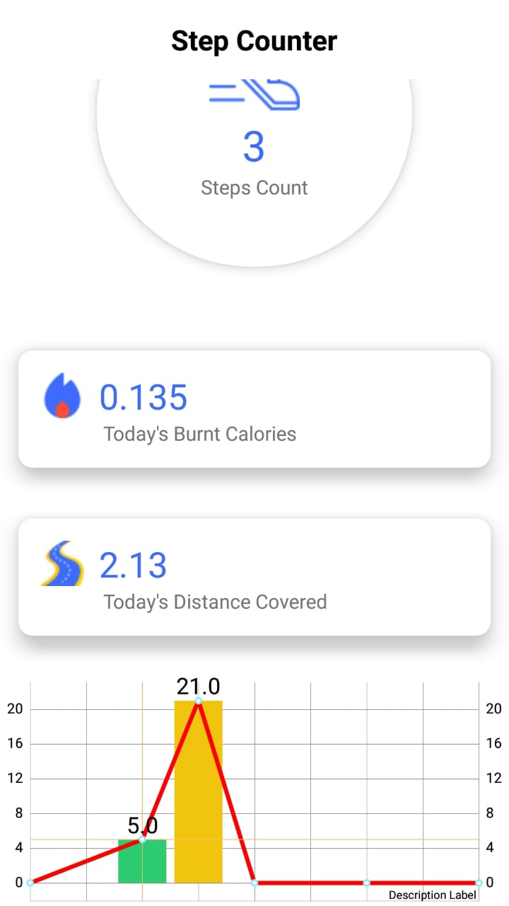
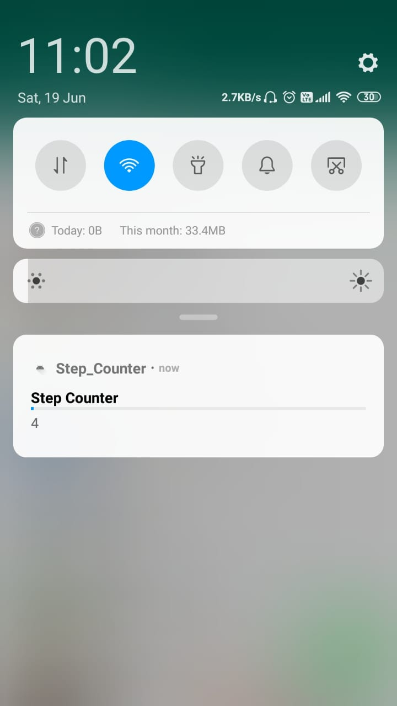

# Step-Counter
This is basic android application to count the step daily basis. After that this application show daily steps in graph format. I used accelerometer sensor from mobile. So to the steps of person, your mobile must have accelerometer sensor. 
<b>Screenshots</b> 

